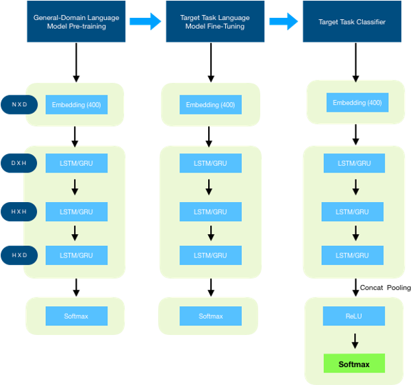

# Assange
Assange is a sentiment analysis tool. It can be used by anyone who wishes to analyse the public sentiment on any topic. With Assange, you can do the following:
1. Get a public sentiment on any topic where sentiment can be positive, negative, and neutral.
2. Enlist public figures from tweets
3. Sentiment on each collected tweet in the topic 
4. Sentiment for entities mentioned throughout in the topic.

## Software Design
### End-to-end picture
The s/w will scrape Twitter using Tweepy [6] and will use a pub-sub model to stream the output data (sentiment and entities). The pub-sub feature makes it available as an on-demand tool for the end user. The s/w will continuously train itself with tweets and articles in batches and will always be available to be queried for the data.

### Deep diving into ML design
Overall, this project is broadly a classification problem [7] as we are taking public sentiments (tweets, articles, etc.) on certain topics (economy related) and classifying them (positive/negative OR against/supportive). The Twitter data set is considered as a noisy dataset [8], and it being an untagged data gives us a new challenge: performing classification on untagged data. Due to this, we have to use transfer learning model as it is suitable for less tagged data [9]. Transfer model first learns the language for which Wiki data set is used (which is a huge data set). So, Wiki Text 103 is used to train our model and make it (the model) learn semantics of the English language. 

#### Steps:
1.	Pre-training: Build a language model by training on Wiki-text 103.
2.	Target Language Model: Feed our model with tweets so that it learns Twitter data set, learn the semantics of it. We do this step so as to make our model customized to our needs (Twitter data) instead of general English language.
3.	Target Classifier: After making our model learn the semantics in step 2, we will use classifier model to make it learn the classification. We will use the Twitter data set along with IBM Watson NLU’s sentiment analysis to train our model. This is a significant step as IBM Watson NLU will be used to verify the results of our approach. IBM Watson’s NLU has been heavily adapted by YC funded startups [10] so it can be treated as a benchmark.
4.	Improving accuracy of Target LM.
a.	Freezing: Freeze all the layers so that trained weights do not get lost. I will use GRU as it is less computationally intensive than LSTM [11] otherwise will switch to LSTM. Both of them provide with the freezing abilities.
b.	Scheduling Learning Rate: We will schedule the learning rate to reach the optimized result so that we can get the best stable state of our learning i.e. accuracy.
c.	Discriminative Fine Tuning: We will optimize learning rate in different layers within an iteration so that we can reach optimization across them in a smaller number of epochs.
5.	Improving accuracy of Target Classifier:
a.	Concat Pooling: We cannot only consider input(data) from the last hidden state as the input set consists of thousands of words and a lot of information might get lost. Thus, any hidden state h at a time t will be concatenated with the maximum and average pool of the hidden states currently in the memory (GPU) as suggested in [12].
b.	Linear Decoder: ReLu and Softmax (shown below) together form a linear decoder to classify whether the input is in favor or against.
c.	Gradual Unfreezing: We want to unfreeze when we want to make our model to train on our target.
Variable Architecture
The variables in architecture are as follows:
1.	N: number of tokens
2.	D: Embedding Dimension
3.	H: Hidden activations per layer

# Setup
## IBM Watson
We use IBM Watson to train our data and to enlist entities. Assange is used thereafter to perform sentiment analysis and the accuracy is measured against Watson. Hence, users need to create a free account on IBM Watson NLU and place the configs in config.txt and take structure from demo_config.txt
## Tweepy
Users need to create an app on Twitter and place their access keys in config.txt
## Assange
`git clone https://github.com/kebab-mai-haddi/machine-learning.git`

`cd machine-learning`

`pip3 install -r requirements.txt`
## MongoDB
Install MongoDB and create a database named `phase3`. We will make this dynamic as well.

# Creating data repository for a topic
## Collecting data on a topic
`python3 twitter.py`
> Please enter the topic name
Enter the topic of your choice, for eg "Modi" on the prompt.
## Prepare and export data
`python3 prepare_data.py`
## Train Assange on this topic
`python3 fast-ai.py`
> Please enter path of the file.
> /Users/aviralsrivastava/dev/machine-learning/data_repository/Modi.csv

# Usage
## Fetch sentiment on a topic
`python3 display-sentiment.py`
## Fetch entities and their sentiments in a topic
`python3 display-entities.py`
## Fetch sentiment on tweets
`python3 export-tweets-sentiments.py`

# Test
Our application is tested in blackbox style and we plan to include more tests. However, our ML model testing is completed in the following manner:
1. We test our accuracy against IBM Watson NLU
2. While executing the file fast-ai.py, we show the accuracy results in the console which are idempotent and can be repeated. We don't intend to store accuracy results as we believe in maintaining single source of truth via re-executions.

# References
[1] Jeremy Howard and Sebastian Ruder, “Introducing state of the art text classification with universal language models”

[2] Howard and Ruder, “Universal Language Model Fine-tuning for Text Classification”

[3] https://en.wikipedia.org/wiki/Publish%E2%80%93subscribe_pattern

[4] https://researcher.watson.ibm.com/researcher/view_group_pubs.php?grp=147

[5] Dr Eric in ML lectures, MC.AI(https://mc.ai/learning-through-trial-and-error/)

[6] http://docs.tweepy.org/en/v3.8.0/

[7] Sebastian Ruder, “Semi Supervised Learning…text classification”. (https://ruder.io/semi-supervised/)

[8] Joshi, et al, “Twitter Sentiment Analysis System”, International Journal of Computer Applications, 2018

[9] Ding et al. “Empirical Study and Improvement on Deep Transfer Learning for Human Activity Recognition”, (https://www.ncbi.nlm.nih.gov/pmc/articles/PMC6339185/, “target uses less unlabeled data”)

[10] “YC funded startup Trenity uses IBM Watson NLU”, available here(https://developer.ibm.com/blogs/trenity-uses-watson-nlu-to-build-a-sports-engagement-platform/)

[11] Anand et al. “Approximate Computing for Long Short Term Memory (LSTM) Neural Networks”, IEEE.

[12] ULMFiT RNN Classifier (https://forums.fast.ai/t/ulmfit-get-rnn-classifier-concat-pooling/25102)

[13] SemEval Stance Task Classification (http://alt.qcri.org/semeval2016/task6/)

[14] India Misinformation Election, The Atlantic (https://www.theatlantic.com/international/archive/2019/04/
india-misinformation-election-fake-news/586123/
